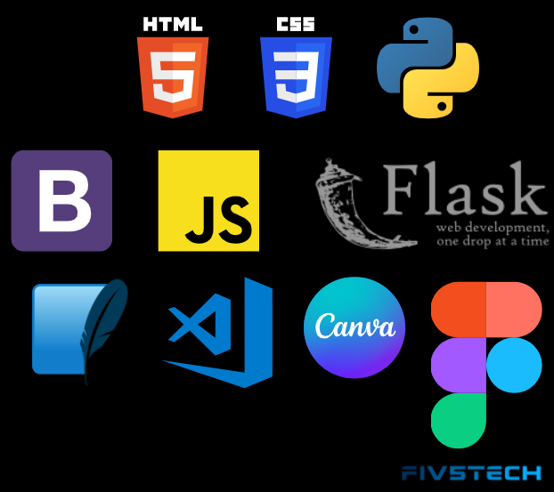

# **Fiv5Tech Co.** 

A Fiv5Tech Co. é uma StartUp fundada por profissionais de tecnologia, com o objetivo de transformar a maneira como são encontradas as vagas de emprego no Brasil. Isso tem sido possível graças a agilidade e praticidade que trazemos através do trabalho de nossos desenvolvedores.

## **O Problema**

Desenvolver um sistema web para automatizar o processo de catalogar vagas de diversas profissões principalmente TI e configurar métricas para pontos como tipos de conhecimento, habilidades e competências. Visualmente deverá ter informações do tipo estratégicas (gráficos), facilidades de usabilidade e operação bem como toda a documentação de desenvolvimento lastreado no GitHub com todos os processos necessários para a fidelização do cliente.

## **Requisitos de Projeto**

Seguem abaixo os requisitos de projeto, elencados pelo cliente:

**Status do projeto:**
- 1ª Sprint - Concluída 
- 2ª Sprint - Em andamento
- 3ª Sprint - Em andamento

## **Análise dos Requisitos**

Dados os requisitos de projeto, a Fiv5Tech Co. elaborou insights sobre o produto ideal, que atenderia as necessidades do cliente da melhor forma. Esta análise foi validada junto ao cliente, onde constam os requisitos divididos em três categorias: "Imprescindível", "Importante" e "Seria bom ter".

## **Cronograma das Sprints**

## **Backlog do Produto**

# **Burndown Chart - 1ª Sprint**

# **Burndown Chart - 2ª Sprint**

## **Tecnologias Utilizadas**

## **Metodologias Utilizadas**

**SCRUM**

Scrum é um framework com o qual as pessoas podem resolver problemas complexos e adptáveis, enquanto entregam produtos de forma produtiva e criativa e com o maior valor agregado possível.

Scrum é:

* Leve
* Simples de entender
* Difícil de aplicar

Scrum consiste do time Scrum e seus papéis, eventos e artefatos que coordenam o relacionamento e a interação entre os membros. Apesar de ter sido criado originalmente para desenvolvimento de software, Scrum pode ser usado em qualquer tipo de projeto, contanto que haja um certo grau de complexidade, já que ele se baseia na teoria de controle empírico de processos, ou empirismo.

Um processo empírico é aquele onde diversos imprevistos ocorrem - diferente de um processo definido - e tomamos alguma atitutde para resolvê-los. Desta forma, você melhora o processo à medida que trabalha com ele, já que as coisas não ocorrem sempre da mesma forma. 

Diferente de uma linha de montagem, onde cada passo pode ser previsto e monitorado, em projetos de desenvolvimento complexo de softwares isso se torna impossível, e daí a razão de se utilizar um processo empírico.

**MVC - Model View Controller**

MVC (Model-View-Controller) é um padrão em design de software comumente usado para implementar interfaces de usuário, dados e lógica de controle. Ele enfatiza uma separação entre a lógica de negócios do software e a exibição. Esta "separação de interesses" proporciona uma melhor divisão do trabalho e uma melhor manutenção. Alguns outros padrões de design são baseados em MVC, como MVVM (Model-View-Viewmodel), MVP (Model-View-Presenter) e MVW (Model-View-Whatever).

As três partes do padrão de projeto de software MVC podem ser descritas da seguinte forma:

* Modelo: Gerencia dados e lógica de negócios.
* View: lida com layout e exibição.
* Controlador: roteia comandos para as peças do modelo e da visualização.

## **Wireframes das páginas**

**Página Home**

**Página de Vagas**

**Página de Cursos e Certificações**

**Página de Métricas**

**Página de Localização**

## **1ª Sprint - Entrega das páginas Home e Vagas**

## **2ª Sprint - Entrega das páginas Cursos e Certificações, Métricas e Localização**

## **Equipe**

| Nome | Função |
   |---|---|
| Leandro Aquino | Product Owner |
| Yago Pereira | Scrum Master| 
| Eliézer Lopes | Developer |
| Thiago Bueno | Developer | 
| Wellington Souza | Developer |